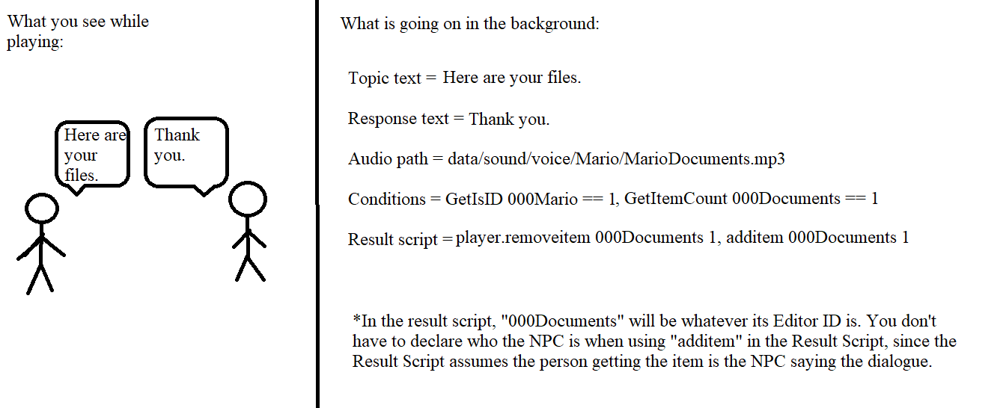
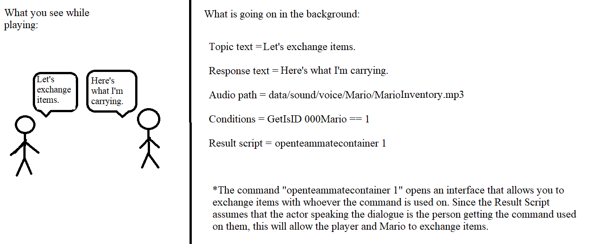
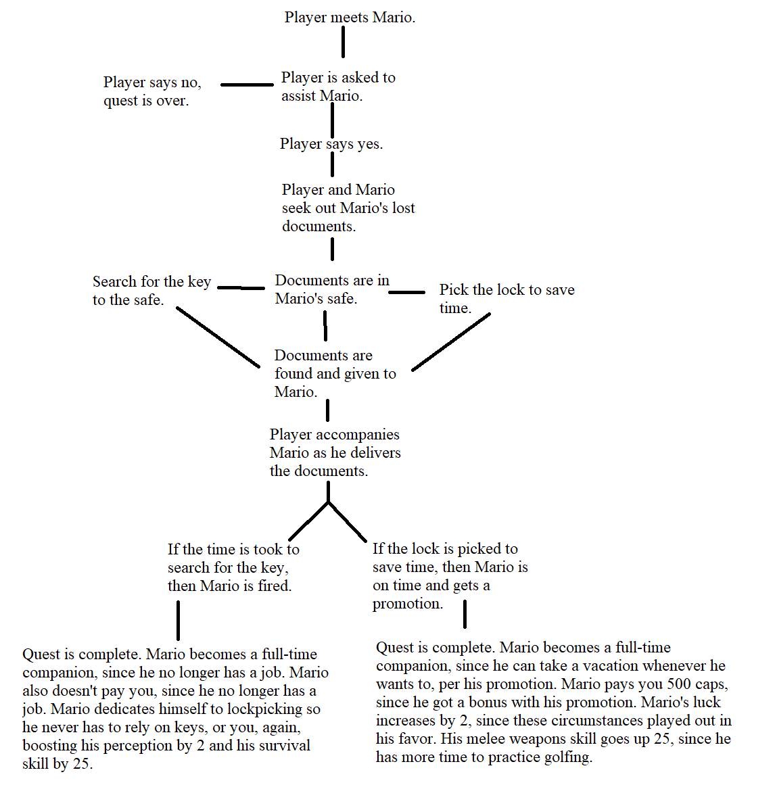

# D3 Lo-Fi Prototype

## Visual Documentation

### Companion Firing

### Exchanging quest-relative item

### Exchanging general items

### Healing

I used these styles of diagrams because I believe that they let me properly convey the intricacies of what is going on in the background. While you and I may see dialogue between two characters, you are missing the scripting that causes that dialogue to hold any sort of weight. It is also important to showcase how things like healing, exchanging quest-relative items, and exchanging general items work, since these systems are vital to interaction with the companion and the quest around them. For things like item exchange and healing, you will interact with these systems for as long as the companion is still hired and in your party.

### Quest Structure

I created a flow chart for the story of the quest to better show the flow of how the quest is going to work. This is the "new" part of the project to me, and this flow chart helped me visualize what is happening when in the quest and what I will need to do in the project to reflect it.

### Glossary

I defined frequently used terms so my mockups are easier to understand.

## Reflection

The process of creating my prototypes was difficult at first. For this type of project, I had never made a prototype before. But once I started to recognize which systems I wanted to prototype, creating the mockups became easier, since I had an idea in mind of what they should look like. Thanks to building this prototype, I have refreshed my knowledge of how the systems are designed and am better equipped to be building them. Also, now that I have a visual reference, I have something to compare my final design to.

Fortunately, I have no lingering questions. I believe this prototyping assignment has prepared me adequately for the implementation and creation of the systems I will be working with.
