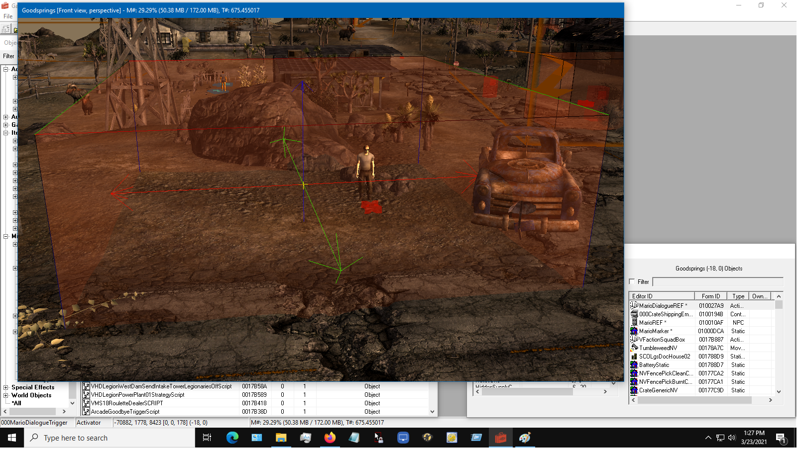

# D4 Midterm Documentation

## Proof of Concept

### Dialogue: Companion Firing

This is what firing Mario looks like in the GECK.

### Dialogue: Goodbye

This is a dedicated "Goodbye" dialogue used as a failsafe to always be able to exit dialogue.

### Dialogue: Greeting

This is how Mario greets the player.

### Dialogue: Healing

This dialogue runs commands that heal Mario at the cost of one Stimpak from the player.

### Dialogue: Hire

This is what the hiring dialogue looks like in the GECK.

### Dialogue: Inventory

This dialogue runs a command that allows the player and Mario to share items.

### Dialogue: Wait

This dialogue tells Mario to stay where the player asks him to.

### Dialogue: Asking for Help

This is Mario asking the player for help.

### Dialogue: Asking for Help: Yes

This dialogue is the player accepting the quest.

### Dialogue: Asking for Help: No

This dialogue is the player refusing the quest.

### Dialogue: Return the Notes

This dialogue allows the player to return the notes to Mario and complete the quest.

### Quest: Stage 5

This is how the quest handles the player refusing the quest.

### Quest: Stage 10

This is how the quest manages looking for the notes.

### Quest: Stage 20

This stage manages returning the notes to Mario.

### Quest: Stage 30

This stage is the completion stage that manages ending the quest and rewarding the player.

### Script: Mario Companion Script

This script manages which companion package Mario uses and when he uses it.

### Script: Mario Trigger Script

This script tells Mario to engage the player in dialogue when the player enters the bounds of the trigger.

### Script: Update Quest on Notes Retrieval Script

This script updates the quest when the player collects the notes.

### In Engine: Mario in Goodsprings

This is a picture of Mario standing next to his marker while inside of the bounds of his trigger.

## Concept Documentation

### 1. What external software or tools are needed to run your proof-of-concept?
You will need Fallout: New Vegas to use the mod. You will need Fallout: New Vegas's version of the Garden of Eden Creation Kit to modify and edit the mod.

### 2. What steps would need to be taken to run your proof-of-concept?
You would need to place the .esp file the mod uses in the Fallout: New Vegas data folder (The file directory is typically C:\Program Files (x86)\Steam\steamapps\common\Fallout New Vegas\Data). After placing the .esp file in the appropriate folder, you would go to the Fallout: New Vegas folder (The file directory is typically C:\Program Files (x86)\Steam\steamapps\common\Fallout New Vegas) and run "FalloutNVLauncher.exe." After running the .exe file, a screen should pop up with several different options. The option you would select is "Data Files." In the next window that pops up, you would want to make sure that "FinalProjectMNCompanion.esp" has the box next to it checked.

### 3. What is the current functionality of the proof of concept as you have submitted it?
Mario's companion functionality is complete. He follows the player when asked. He waits when asked to wait. He goes back to his initial position when fired. A basic quest where you return a set of notes to him is also complete. I plan on expanding the quest and the features in it in the future.

### 4. Are there any components of the code or systems you have submitted that you did not create? If so, document them here alongside their source or reference.
I referenced two forum posts when creating the scripts used in this mod.
https://forums.nexusmods.com/index.php?/topic/2456384-attempting-to-have-a-conversation-activate-on-trigger/
http://www.gamesas.com/companion-follower-tutorial-t52693.html

## Updates

As I am performing well in my ability to solve issues and add functionality with relative ease, I will hold to my initial plans of creating a voiced companion modeled after Mario Nakazawa, creating a quest for him, creating a perk for him, and giving him random things to say in certain areas.

## Reflection

### How confident do you feel about your project now that you have created a working proof-of-concept?
I feel pretty confident in my ability to do what I have set out to do. I am learning new things as I go along, but I feel resourceful enough to address any issues I may run into.

### Have you faced any significant challenges in the creation of your project so far? If so, what are they?
I have an issue trying to get the quest to properly update to inform the player as to when they had found the notes. I also have an issue where I can continuously take the notes away from Mario and give the notes back to Mario. I have been able to solve both of these issues.

### What do you need from instructors and teaching assistants to better help you implement, understand, or otherwise think about your project?
I think everyone involved has been incredibly helpful and supportive so far. This has been me relearning how to understand something I already had some prior knowledge on, so just keep asking me questions about what I'm doing and I will have to keep pushing myself to make sure I understand what I am doing enough to answer those questions.
