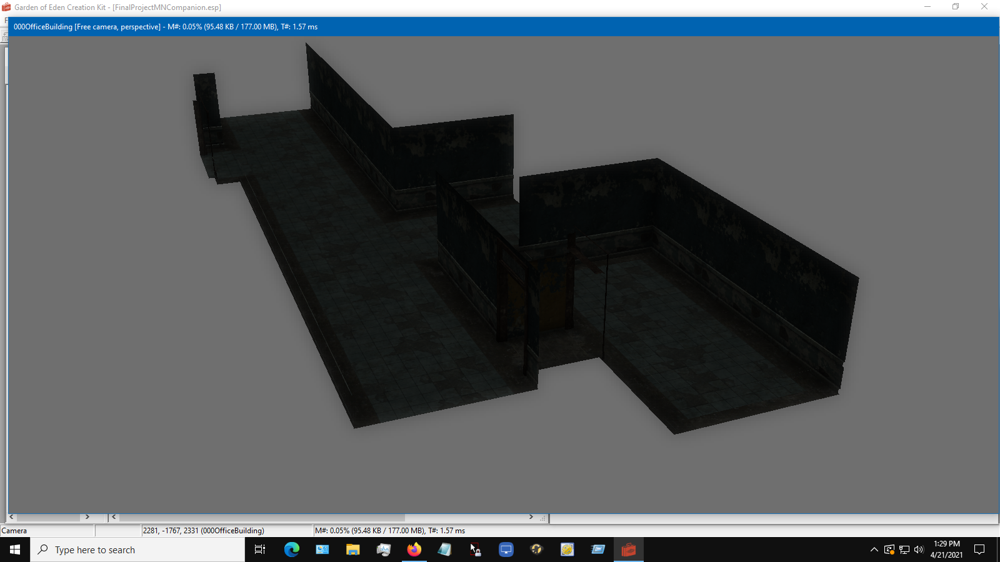
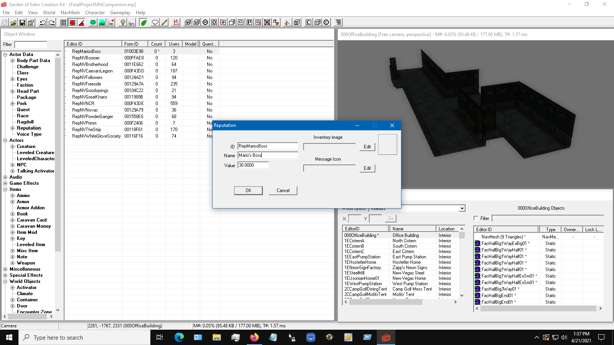
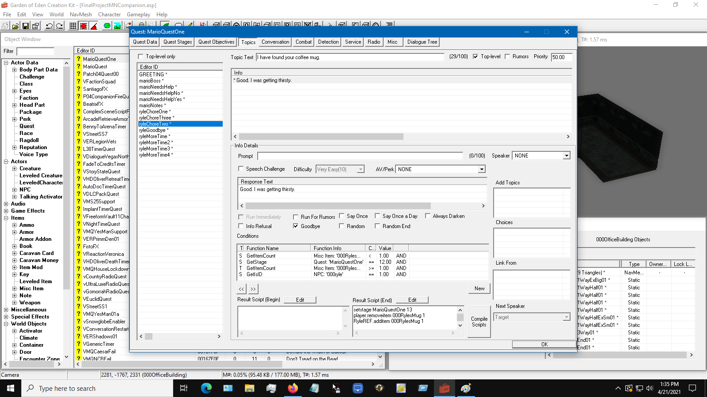
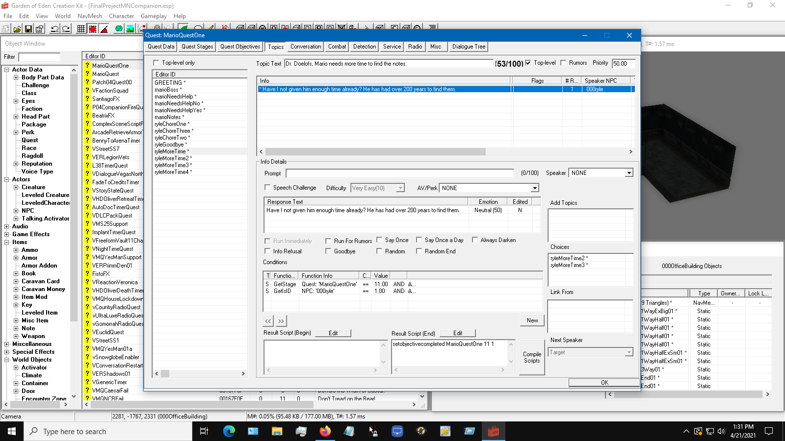
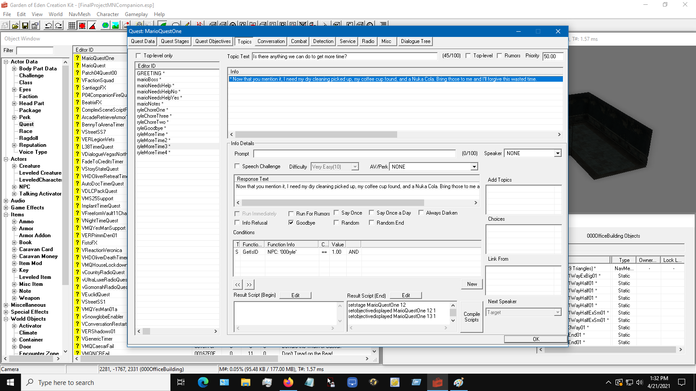
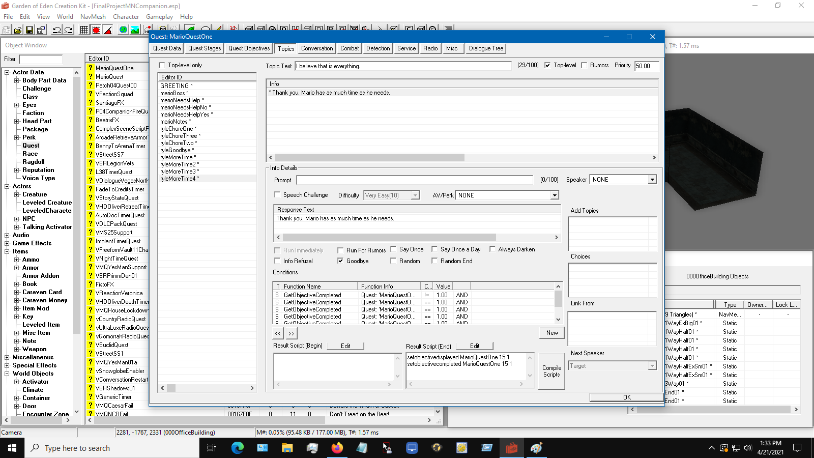

# Weekly Reflection- Week Three

1. What have you accomplished this week? (Please list each accomplishment, and explain)
  * I have finished work on the optional objectives and have added them to the quest. I have finished the reputation system. I have began work on the new interiors for the quest.

2. What challenges or difficulties did you face? If you solved them, how? If not, what have you learned so far? Have you sought help or other resources?
  * I have had to manage time with other classes. I have several mid term assignments coming up, so next week is looking a bit rough when it comes to finding time for this.

3. What do you plan to accomplish in the following week? (Please list at least 3 concrete "S.M.A.R.T." goals, along with estimated number of hours to complete, or day to complete)
  * I will start work on the dialogue between Mario and his boss. This should not take long. Two hours at most. I will make sure the quest can be completed. This will take around an hour. I will create perks for Mario. This should take an hour. I will continue my work on the new interiors. With my recent breakthrough with the GECK, this will probably take two to three hours.

4. What resources will you use to accomplish your goals for the upcoming week? (please list out the resources)
  * I will continue to use the GECK wiki https://geck.bethsoft.com/index.php?title=Main_Page.
  * I will also be using Seddon4494's tutorials as a resource https://www.youtube.com/channel/UC8xg-EQk4U5AmkvBJfHGYDg.
