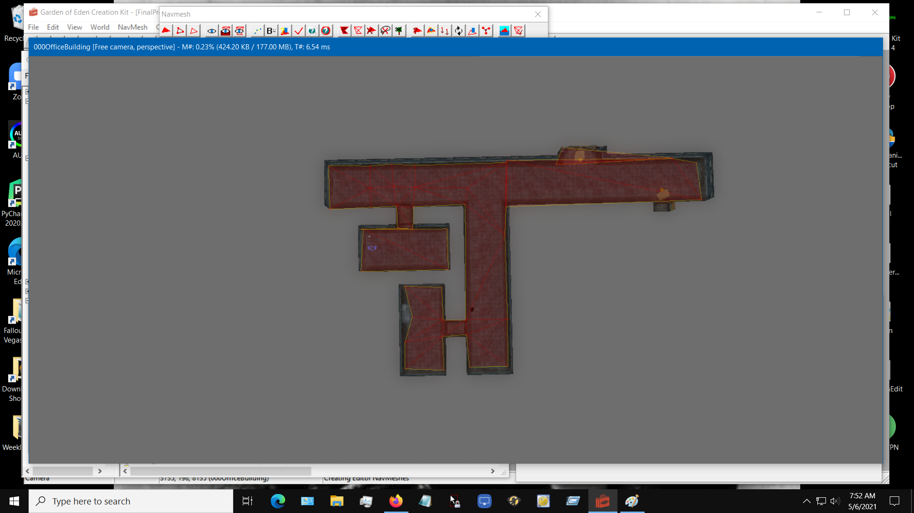
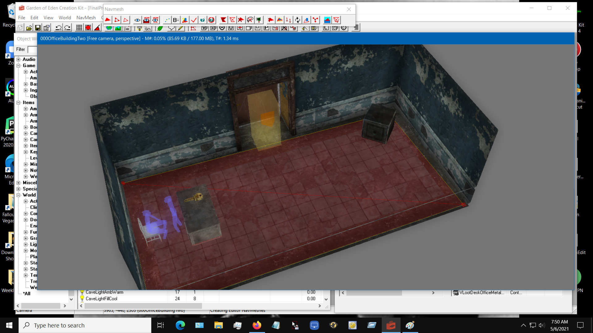
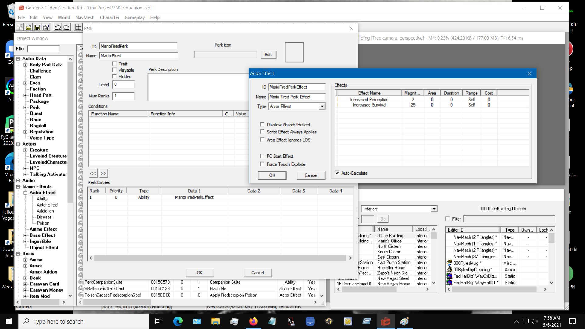
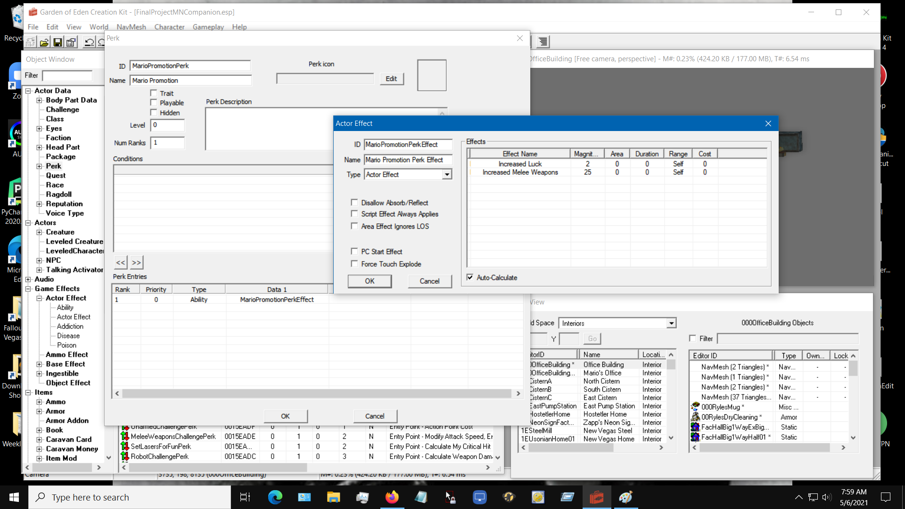
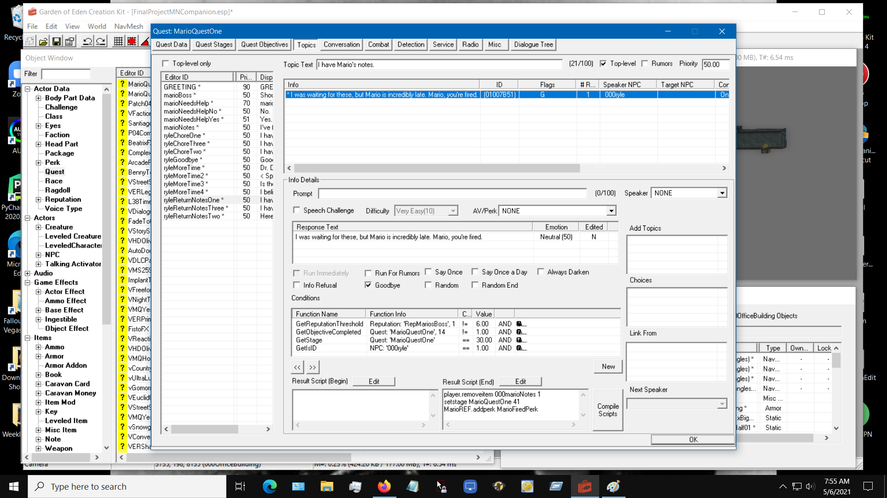
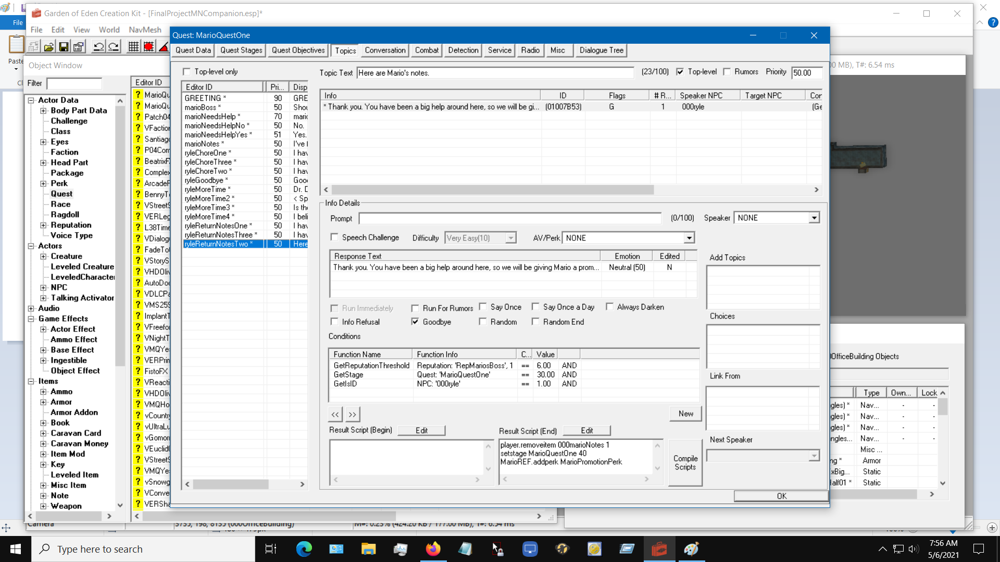
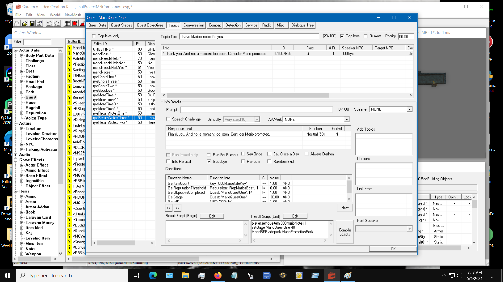

# Weekly Reflection- Week Five

1. What have you accomplished this week? (Please list each accomplishment, and explain)
  * I have finished the interiors for the mod. I have made the interiors accessible in game. I have finished navmeshing (movement pathing for AI) for the interiors. I have finished the companion perks that are rewarded on completion of the quest. I have made the quest finishable. It is important to note that certain things are going to have to get cut for the sake of time. I have decided that voiced NPCs are too time intensive to be done. Also, I have scrapped the dialogue between Mario and his boss for the same reason.

2. What challenges or difficulties did you face? If you solved them, how? If not, what have you learned so far? Have you sought help or other resources?
  * I have had to begin preparing to move out at the end of the semester. I have been working on a paper due this Friday.

3. What do you plan to accomplish in the following week? (Please list at least 3 concrete "S.M.A.R.T." goals, along with estimated number of hours to complete, or day to complete)
  *  I would like to add an indicator at the completion of the quest to inform you which perk Mario got. Depending on how I do this, it could take five minutes or maybe an hour. I would like to add lighting to both interiors. Lighting doesn't work the way I thought it would, so I would need to take time to figure it out. This should take around two hours. I would like to add more decorations to the interiors. This should take an hour or two. I would like to start work on some extra Mario dialogue that triggers in certain areas. Depending on how many I want to add, this will be a stretch goal that I work on over the next few weeks.

4. What resources will you use to accomplish your goals for the upcoming week? (please list out the resources)
  * I will continue to use the GECK wiki https://geck.bethsoft.com/index.php?title=Main_Page.
  * I will also be using Seddon4494's tutorials as a resource https://www.youtube.com/channel/UC8xg-EQk4U5AmkvBJfHGYDg.
